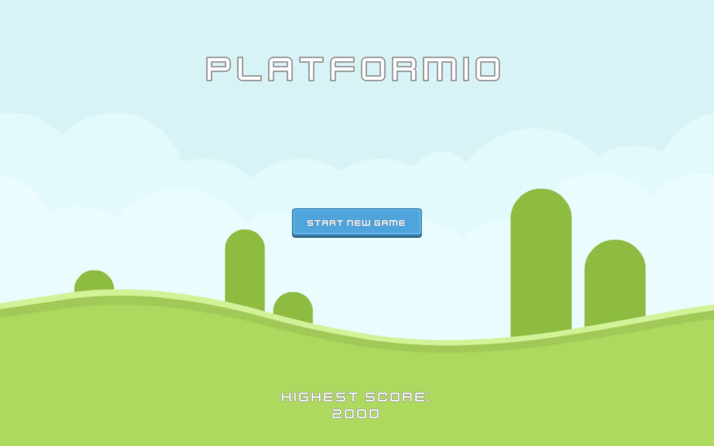
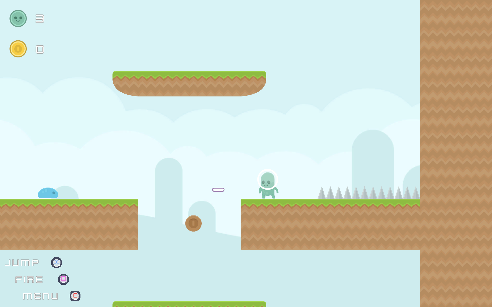
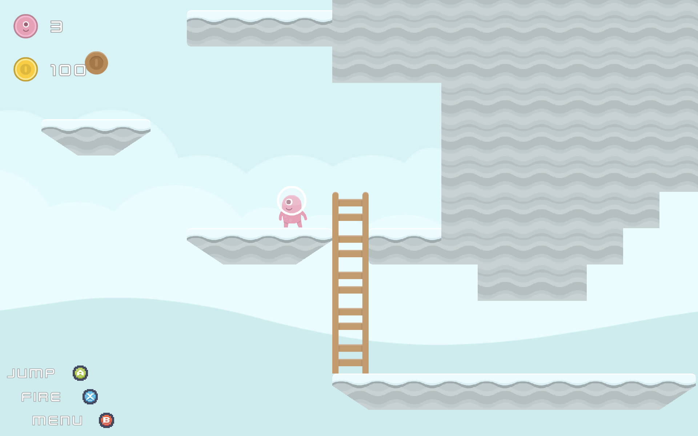
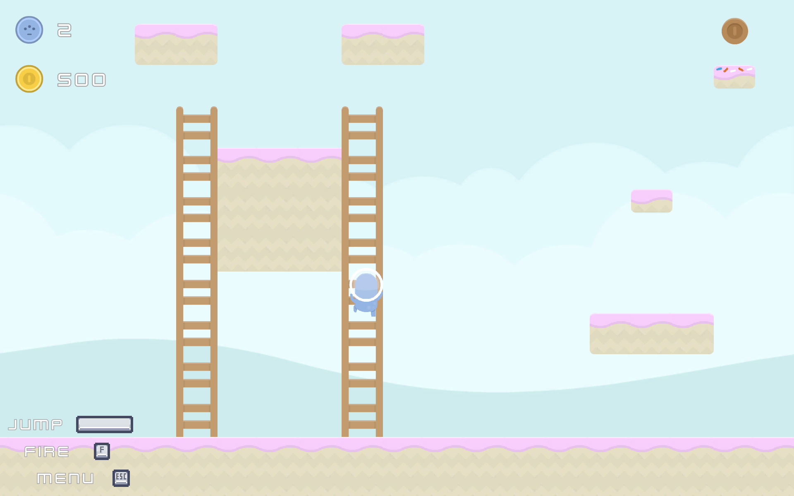

# Platformio

## Summary

Essentially the game is an infinite loop of random levels with keeping track of the max score. 
The infinite loop combines predefined level structures and several visual/sound themes. 
It supports both Keyboard/Mouse and Gamepads for control. 
Music and basic SFX is also available.

### Core mechanics

- Platforming
- Collecting coins
- Shooting enemies
- Avoiding hazards
- A couple of secrets

## Technical features

Levels are split into _structures_ and _themes_ where each level can get any theme to be drawn with. 
It involves custom Tile development.

Some uGUI elements are customized to provide additional behaviour.  

[Extenject](https://github.com/Mathijs-Bakker/Extenject) is heavily used for DI.

Github Actions are used for **CI**. 
The [Unity-Builder](https://github.com/marketplace/actions/unity-builder) workflow is used to produce the **WebGL** build, 
which is automatically deployed to Github Pages and is **available here**: [Platformio](https://javernaut.github.io/Platformio/).

The game uses some well known packages:
 - [InputSystem](https://docs.unity3d.com/Packages/com.unity.inputsystem@1.7/manual/index.html) is used with a single InputActionAsset for everything. 
The package is also used to determine the type of Control Scheme that is currently used in order to adjust icon prompts on UI (like Keyboard/Playstation/Xbox icons).
 - [Cinemachine](https://docs.unity3d.com/Packages/com.unity.cinemachine@3.0/manual/index.html) is used for setting up the camera rules and switching between multiple virtual cameras.

## Screenshots

|   |  |
|-------------------------------------------|-------------------------------------------|
|  |  |

## Acknowledgments
This project uses a set of music, sound and graphical assets made by [Kenney](https://kenney.nl/) in order to make a coherent gameplay.

Another special thanks for [GameCI](https://game.ci/) community for enabling the easy CI integration.

## License
The source code for this project is licensed under the MIT license, which you can find in the [LICENSE](https://github.com/Javernaut/Platformio/blob/main/LICENSE) file.

All used graphical assets as well as music and SFX assets are licensed under the [Creative Commons 0 License](https://creativecommons.org/public-domain/cc0/) by Kenney.